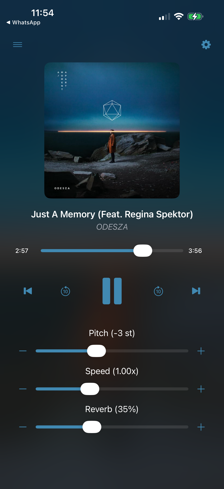
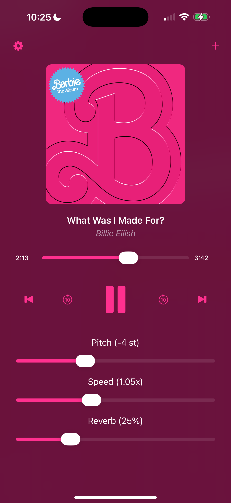
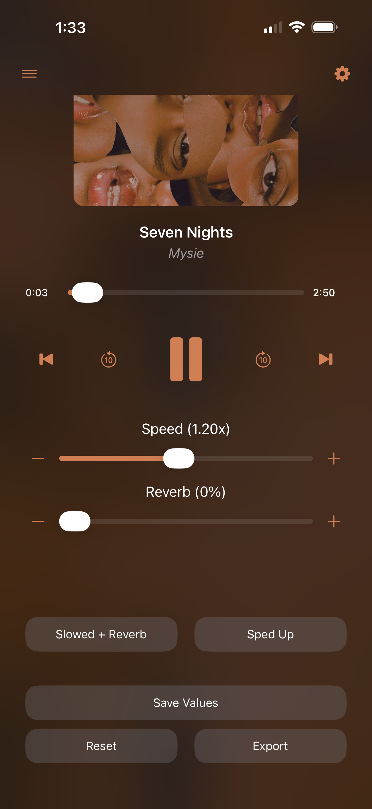
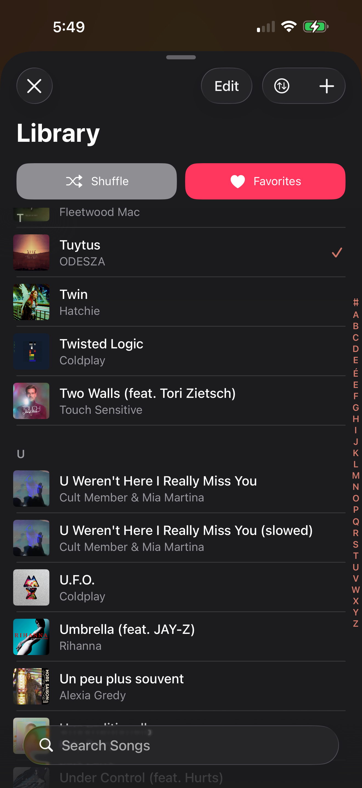
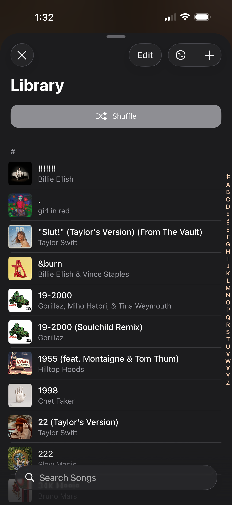
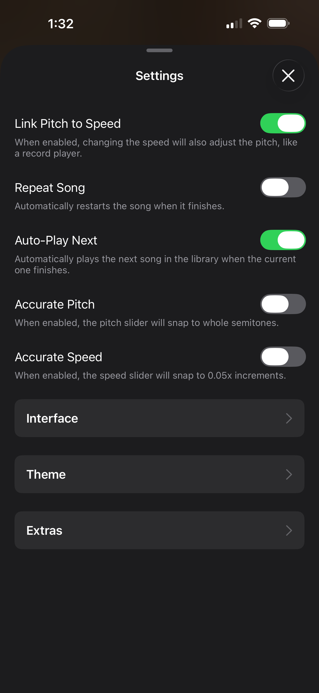
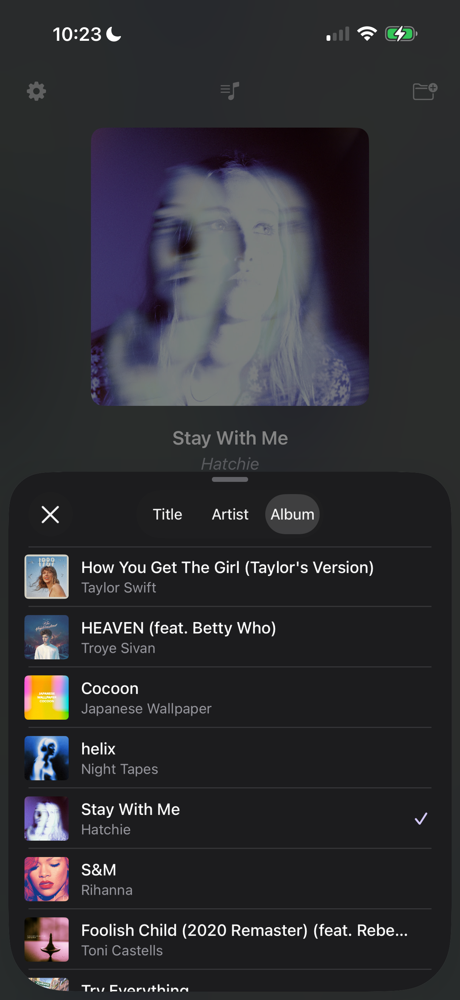

# Slowed + Reverb

  
  
  
  

A powerful iOS audio processing application built with Swift, combining `UIKit` and `SwiftUI`. This app allows users to import audio files, apply real-time effects (tempo, pitch, reverb, EQ), and export the modified tracks with high fidelity.

## Key Features

  
  
  
  
  

### 🎛 Audio Effects & Control
- **Link Pitch to Speed**: 
  - By default, pitch and speed are separated (`AVAudioUnitTimePitch`). 
  - Enable **"Link Pitch to Speed"** in settings to emulate a vinyl record player (`AVAudioUnitVarispeed`). This often results in better sound quality for "slowed" edits as it avoids digital artifacts associated with time-stretching.
- **Reverb Slider**: Add ambience to your tracks with a dedicated reverb effect slider (0% - 100% wet/dry mix).
- **Equalizer**: Fine-tune your sound with a 3-band Equalizer controlling Bass, Mids, and Treble frequencies.
- **Precision Control**: 
  - **Stepper Buttons**: Optional +/- buttons for fine adjustments.
  - **Accurate Mode**: Settings to snap sliders to whole semitones (Pitch) or 0.05x increments (Speed).
  - **Double-Tap Reset**: Quickly reset any slider to its default value by double-tapping its label.

### 💾 Presets
- **Quick Access**: Switch between built-in modes like "Slowed + Reverb" and "Sped Up", or create your own custom presets.
- **Lock Screen Control**: Cycle through your saved presets directly from the Lock Screen or Control Center. The system "Like" and "Dislike" buttons are remapped to "Cycle Presets" for hands-free changes.

### 📤 Exporting
- **High-Quality Export**: Render your modified audio to an `.m4a` (AAC) file using offline rendering for speed.
- **Quality Options**: Select your preferred bitrate (128 kbps, 192 kbps, 256 kbps, or 320 kbps).
- **Metadata Embedding**: The app automatically embeds the original artwork, title, and artist into the exported file so it looks great in your music library.

### 📚 Library Management
- **Local Library**: Import audio files directly from the Files app (`UIDocumentPicker`).
- **Organization**: Sort library by Title, Artist, or Album.
- **Duplicate Detection**: Includes a utility to scan for and remove duplicate tracks to save space.
- **Playback Queue**: Supports Shuffle, Loop (Repeat Song), and Auto-Play Next functionality.

### 🎨 UI & Customization
- **Dynamic Themes**: The app interface automatically extracts dominant colors from the current song's artwork to theme the UI.
- **Dynamic Backgrounds**: Displays a blurred, animated version of the album art as the background.
- **Haptic Feedback**: Integrated `UIImpactFeedbackGenerator` provides tactile feedback when adjusting sliders and interacting with controls.

## Technical Overview

The app leverages the `AVFoundation` framework for a robust audio engine:
- **AVAudioEngine**: The core of the audio graph.
- **Nodes**:
  - `AVAudioPlayerNode`: For playback.
  - `AVAudioUnitTimePitch`: For independent pitch/speed processing.
  - `AVAudioUnitVarispeed`: For linked pitch/speed processing (High Quality).
  - `AVAudioUnitReverb`: For environmental effects.
  - `AVAudioUnitEQ`: For frequency adjustments.
- **Offline Rendering**: Uses `enableManualRenderingMode` to export audio faster than real-time.

## Getting Started

1. **Import Music**: Tap the album art placeholder or the library button (top-left) to import songs.
2. **Adjust Effects**: Use the sliders to find your perfect sound. 
3. **Save Presets**: Create your own presets in the Settings menu for easy recall.
4. **Export**: Tap the "Export" button to save your creation to your device or share it.

## Settings

Access the settings menu (gear icon) to configure:
- **Audio Engine**: Toggle "Link Pitch to Speed".
- **Interface**: Toggle dynamic backgrounds, themes, and slider visibility.
- **Behavior**: Configure auto-play, looping, and precise slider controls.
- **Extras**: Manage presets and scan for duplicates.
